## Part 1

- `docker pull`

  - 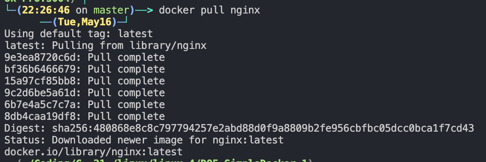

- `docker images`

  - 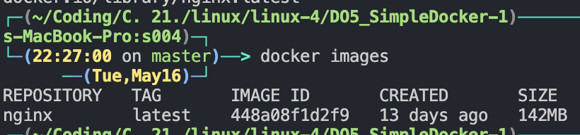

- `docker run -d nginx` and `docker ps`

  - 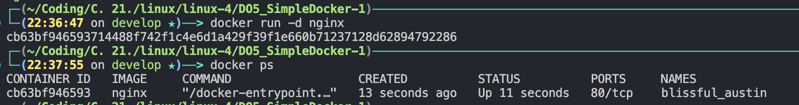

- `docker inspect $(docker ps | grep nginx | awk '{print $1}')`

  - 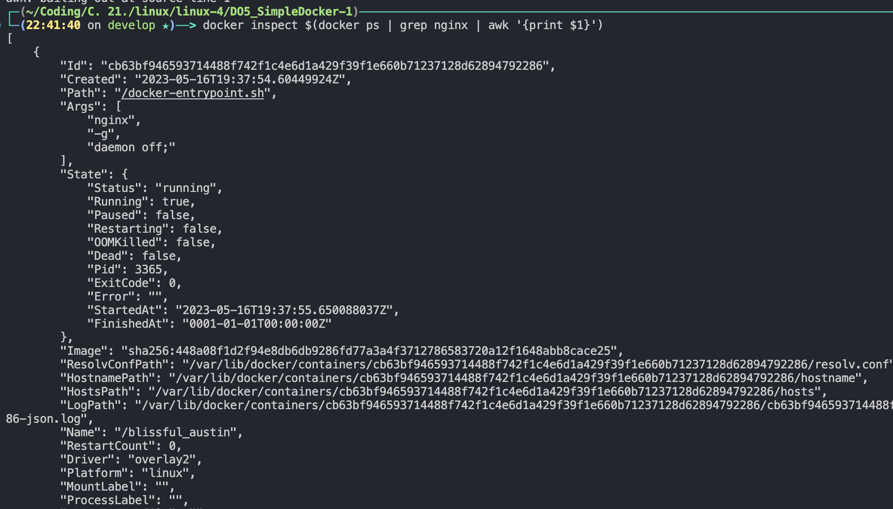
  - Container size: `docker inspect` **does not provide** size info. To find out container size we can use `docker ps -s`
  - List of mapped ports: `"Ports": { "80/tcp": null }`
  - Container IP: `"IPAddress": "172.17.0.2"`

- `docker stop $(docker ps | grep nginx | awk '{print $1}')` and `docker ps`:

  - 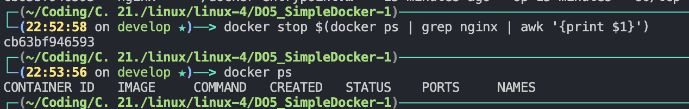

- `docker run` on ports 80 andd 443:

  - 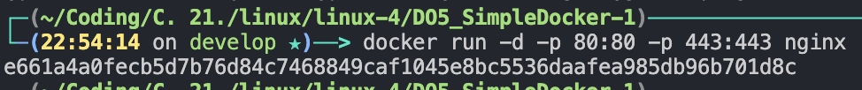

- `localhost:80`:

  - 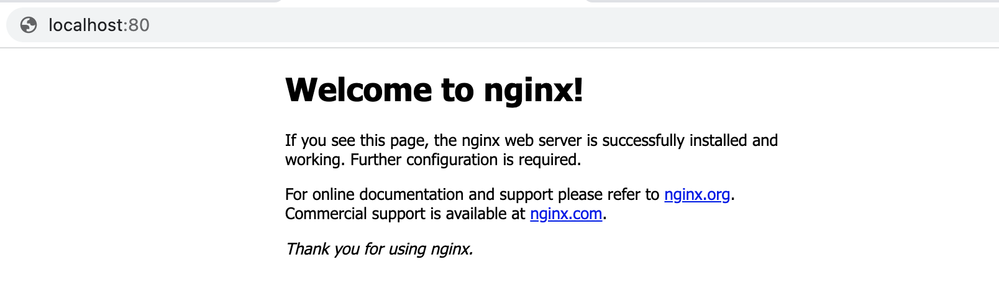

- `docker restart $(docker ps | grep nginx | awk '{print $1}')`:

  - 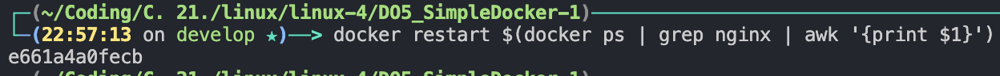

- `docker ps`

  - 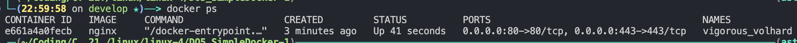

## Part 2

- Read _nginx.conf_ using `docker exec -it $(docker ps | grep nginx | awk '{print $1}') cat /etc/nginx/nginx.conf`:

  - 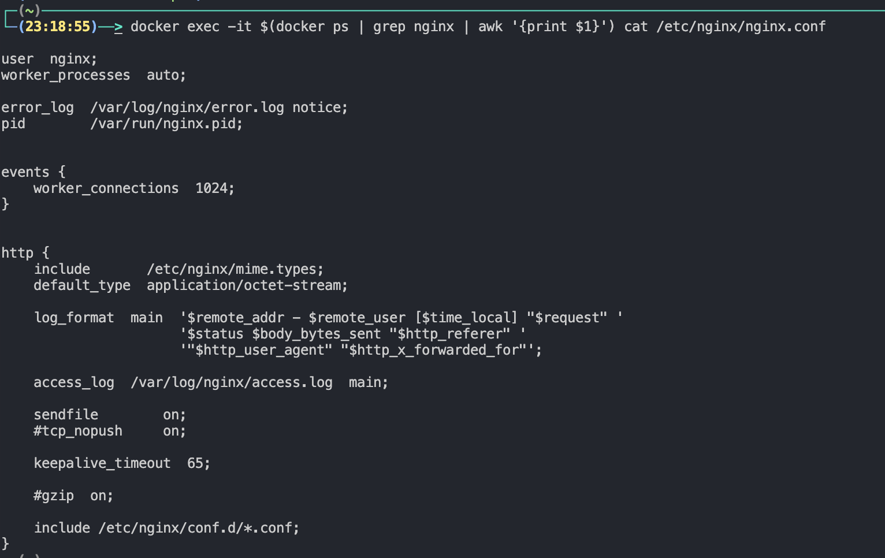

- Created _nginx.conf_ using `vim nginx.conf` and _/status_ path configuration:

  - 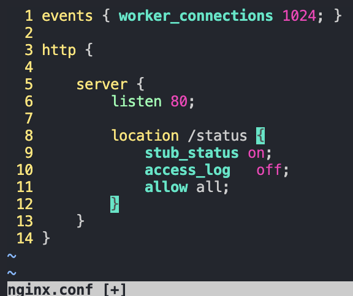

- `docker cp` - Copy the created _nginx.conf_ file inside the docker image:

  - 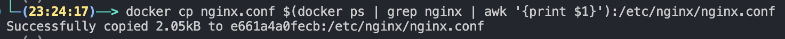

- Restart **nginx** inside the docker image with _exec_:

  - 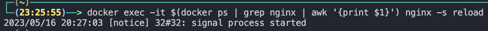

- _localhost:80/status_ using `curl`:

  - 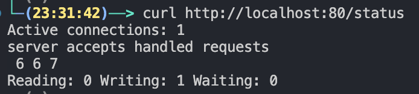

- `docker export ID > container.tar` + `docker stop ID` + `docker ps` (the last one to check if it stopped):

  - 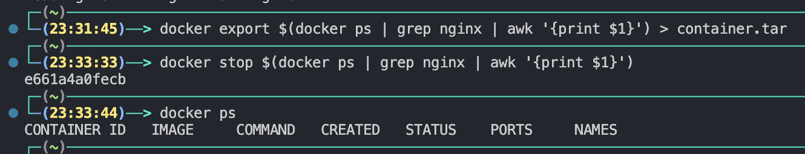

- `docker rmi nginx -f`:

  - 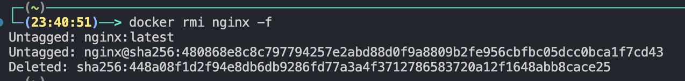

- `docker rm CONTAINER_ID`:

  - 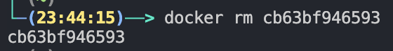

- import container.tar:

  - 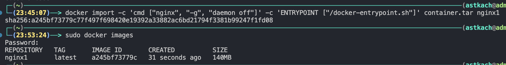

- `curl localhost:80/status`:

  - 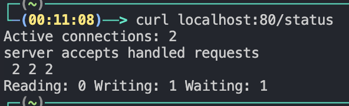
